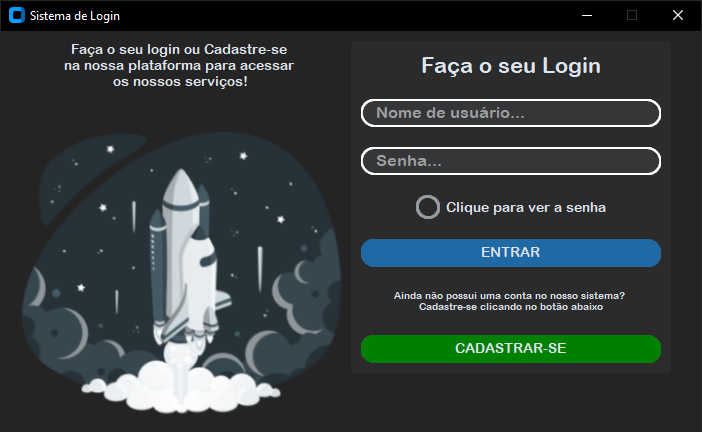
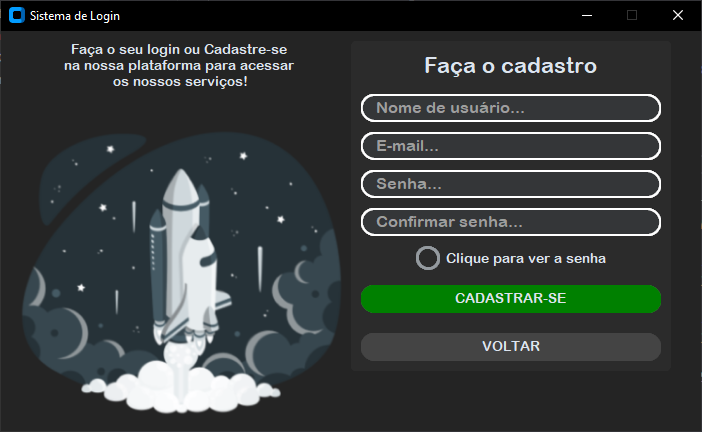

# Sistema de Login/Cadastro
[BR] Sistema de login/cadastro, feito em Python, utilizando o SQLite para criação e conexão a um banco de dados, que irá salvar os usuários do sistema.  
[EN] Login/registration system, made in Python, using SQLite to create and connect to a database, which will save system users.  

## Imagens do Sistema:
 

 

